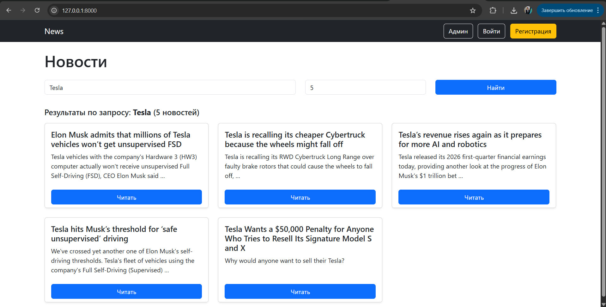
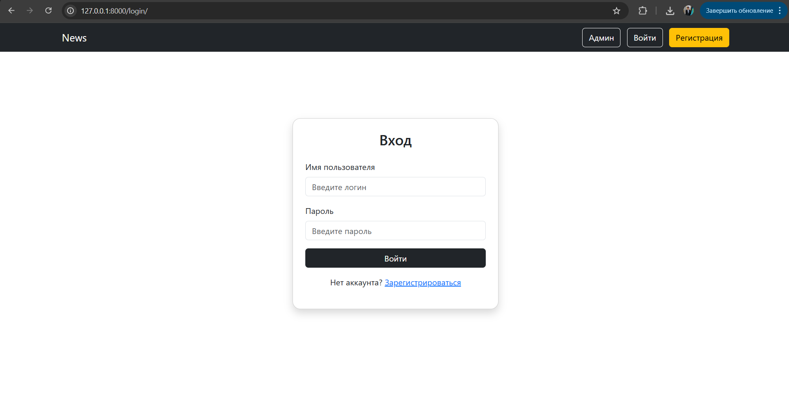
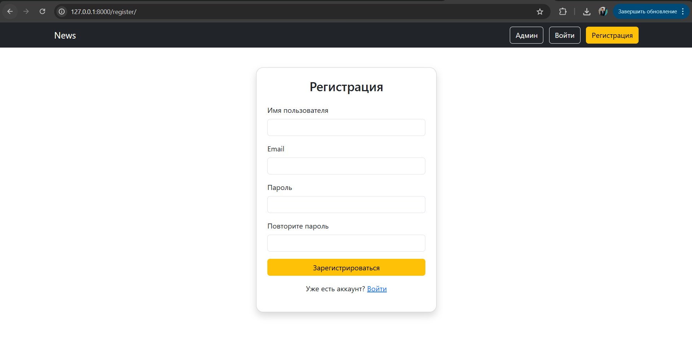
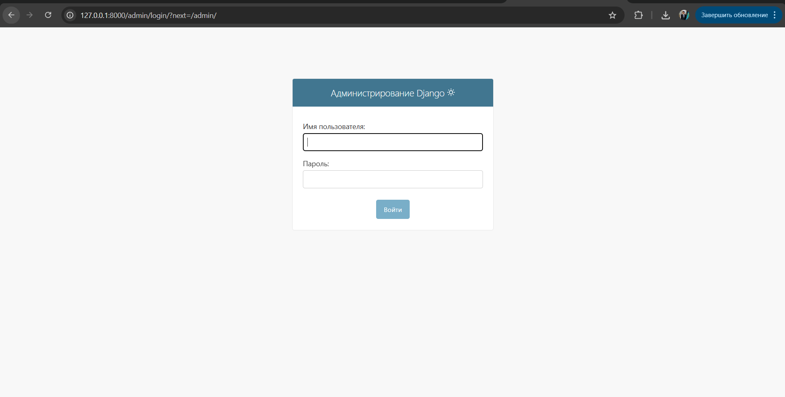
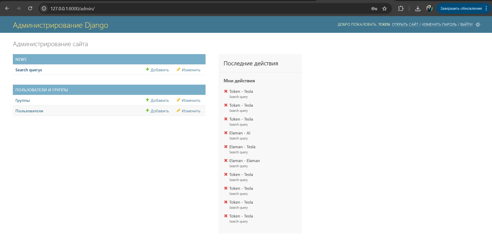
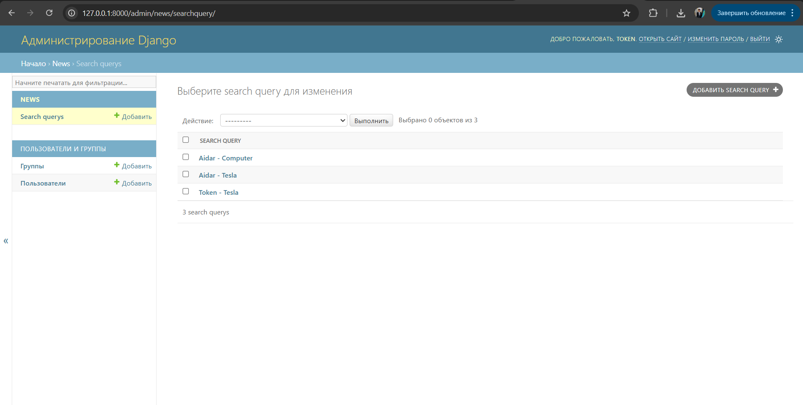
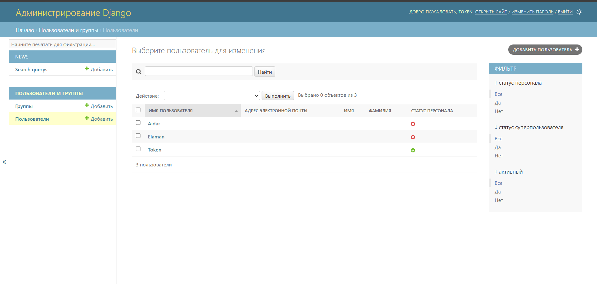

# NewsFinder

## 1. Описание проекта

Данный проект представляет собой веб-приложение на Django, которое позволяет пользователям искать актуальные новости по ключевым словам.

Пользователь вводит запрос, после чего приложение отправляет запрос к внешнему API (NewsAPI) и получает список новостей, которые отображаются на сайте.

Также реализована система пользователей и сохранение поисковых запросов в базе данных.

## 2. Используемые технологии

- Python
- Django
- SQLite
- NewsAPI
- HTML / CSS (Bootstrap)
- requests (для работы с API)

## 3. Основные функции

- Поиск новостей по ключевому слову
- Выбор количества новостей
- Отображение новостей (заголовок, описание, ссылка)
- Регистрация и авторизация пользователей
- Сохранение запросов пользователей
- Админ-панель Django для просмотра данных

## 4. Установка проекта

1. Склонировать репозиторий или скачать проект
2. Перейти в папку проекта:
   cd news_site
3. Установить зависимости:
   pip install -r requirements.txt

## 5. Запуск проекта

1. Применить миграции:
   python manage.py migrate
2. Запустить сервер:
   python manage.py runserver
3. Открыть в браузере:
   http://127.0.0.1:8000/

## 6. Пример работы

Пример:

- Пользователь вводит "Tesla"
- Выбирает количество новостей (не меньше 1 и не больше 20)
- Получает список актуальных новостей

Также запрос сохраняется в базе данных и отображается в админке.

## 7. Админ-панель

1. Создание администратора: python manage.py createsuperuser
2. Для входа в админку:
   http://127.0.0.1:8000/admin/

## 8. Структура проекта

news_project/
│
├── manage.py
├── requirements.txt
├── README.md
├── db.sqlite3
│
├── news_site/
│ ├── settings.py
│ ├── urls.py
│
├── news/
│ ├── models.py
│ ├── views.py
│ ├── urls.py
│ ├── admin.py
│ └── templates/

## 9. Скриншоты

# Главная страница

# Войти и Регистрация

 , 

# Админ панель

 ,  ,  , 

## 10. Итог

В рамках проекта был реализован полноценный веб-сервис, который:

- работает с внешним API
- использует базу данных
- поддерживает систему пользователей
- имеет административную панель

Проект демонстрирует базовые навыки веб-разработки на Django и работу с REST API.
